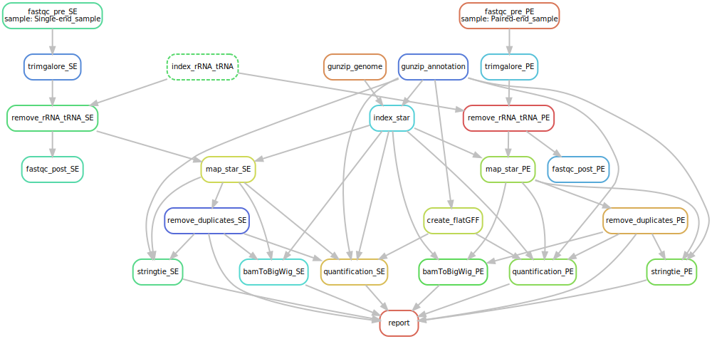

RNA-seq processing pipeline
================
Federico Agostini

## Setup

Please, before running the pipeline modify the `config.yaml` according to your needs.

### Workflow

#### Directed acyclic graph (DAG)

The DAG can be generated using the following command:

```
snakemake --dag "report.html" | dot -Tsvg > dag.svg
```



#### Steps description

* FastQC on the raw data
* Trimming of the adapter sequence
    - Performed with Trim Galore!
* Removal of ribosomal and transfer RNAs contaminations
    - Performed with Bowtie2 on the NCBI dataset
* FastQC on the processed data
* Alignment to the genome
    - Performed with STAR
* Generation of bigWig for visualisation
    - Performed using the ENCODE binaries
* Transcriptome assembly
    - Performed with Stringtie

## To-Do

  - PCR duplicates removal with Picard (files are currenly produced from STAR outputs);
  - ChIP-seq branch (useful for techniques where splicing is not accounted for);
  - Dynamic retrieval of genome and annotation.
